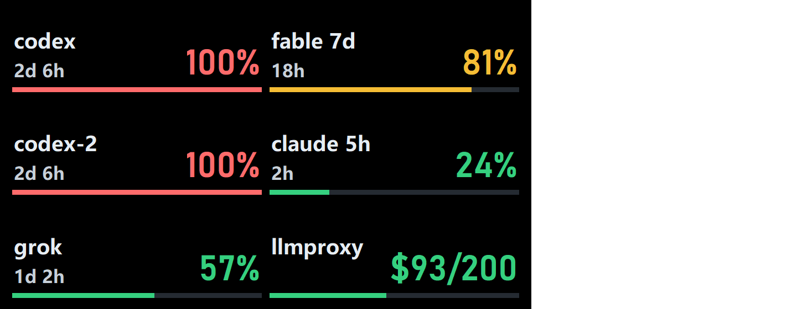
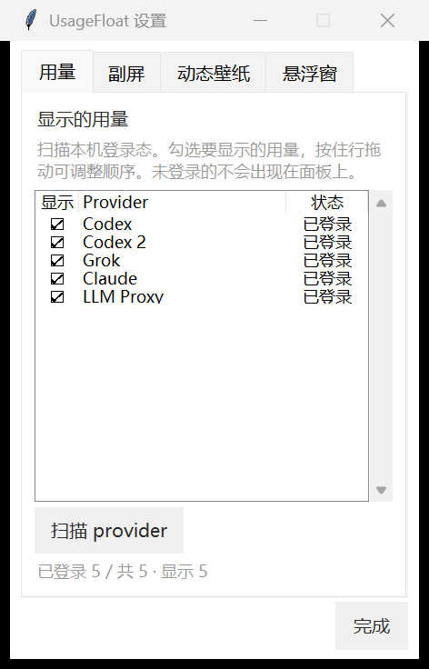
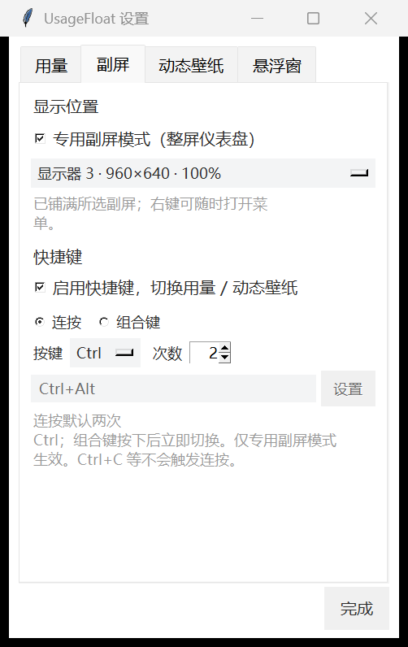
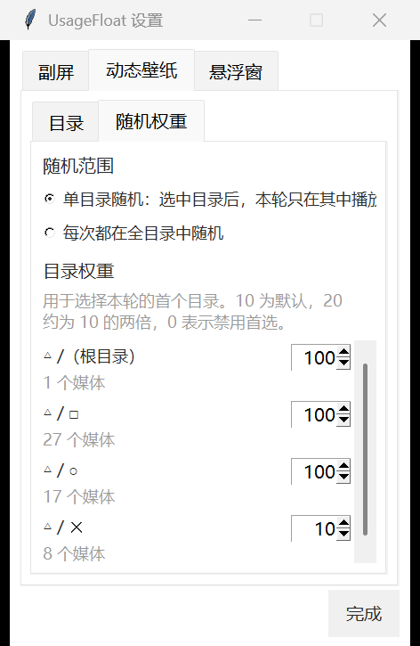

# usage-float

Windows 用量 HUD：把 Claude / Codex / Grok 订阅用量（以及可选的 LiteLLM 代理额度）铺在专用副屏上，双击 Ctrl 切到文件夹动态壁纸。

无标题栏、不占任务栏。没有登录凭证的 provider 不会出现占位行。

## 截图

专用副屏用量面板：



用量设置（扫描、勾选、拖动排序）：



副屏设置：



动态壁纸目录权重（PlayStation △□○✕ 为示例目录名）：



## 安装

**发行包（推荐）**：从 [Releases](https://github.com/iikawa0918/usage-float/releases) 下载 `usage-float-*-windows-x64.zip`，解压后双击 `UsageFloat.exe`。不需要安装 Python，动态壁纸用的 mpv 已打进包里。Windows 可能对未签名程序弹出 SmartScreen，选「仍要运行」即可。

**源码运行**：Windows + Python 3.10+（带 tkinter）。动态壁纸再执行 `.\install-mpv.ps1`，或把 `mpv.exe` 放到 `vendor/mpv/`。

## 凭证

凭证都在本机，不经过第三方服务器：

| Provider | 默认凭证 |
|---|---|
| Claude | `~/.claude/.credentials.json` |
| Codex | `~/.codex/auth.json` |
| Codex 第二账号 | `~/.codex-2/auth.json`（可用 `CODEX_HOME_2`） |
| Grok | `~/.grok` 登录态 |
| LiteLLM 代理 | 环境变量 `LLM_PROXY_API_KEY` + `LLM_PROXY_ENDPOINT`，或 `~/.usage-float/config.json` 里的 `llm_proxy_api_key` / `llm_proxy_endpoint` |

第二 Codex 账号：

```powershell
$env:CODEX_HOME="$env:USERPROFILE\.codex-2"; codex login
```

## 启动

发行包解压后直接运行 `UsageFloat.exe`。源码：

```powershell
python usage_float.py once          # 命令行看一眼
pythonw usage_float.py              # 浮窗 / 副屏
.\start.vbs                         # 脱离当前会话启动
python usage_float.py autostart on  # 开机自启
```

冻结包同样支持 `UsageFloat.exe once` 和右键菜单里的开机自启。

## 交互

| 操作 | 效果 |
|------|------|
| 点击左下角刷新区 | 手动刷新 |
| 点击 Codex 用量数字 | 弹出该账号的重置卡列表 |
| 点击 Claude `5h` 用量数字 | 弹出 Claude 的用量重置列表 |
| 拖动 | 移动悬浮窗 |
| 右键 | 刷新 / 设置 / 切换专用副屏 / 置顶 / 开机自启 / 退出 |
| 快捷键（默认连按两次 Ctrl） | 用量仪表盘 ↔ 动态壁纸；可在设置里改成连按 N 次或组合键 |
| `F5` | 刷新 |
| `Esc` | 退出 |
| `Home` | 复位到主屏角落 |

## 用量

右键 → **设置…** → **用量**：

- **扫描 provider**：读取本机登录态，列出已知 provider 以及是否已登录
- **勾选「显示」**：只把勾上的用量画到面板上；空格键也可切换当前行
- **拖动行**：按住名称或状态列上下拖，调整面板顺序（点第一列是勾选，不是拖动）
- Claude 拆成 `fable 7d`、`claude 7d`、`claude 5h` 三行，各自勾选、各自排序，可以和其他 provider 穿插

未登录的 provider 即使勾选了也不会占位，登录之后才会出现。勾选和顺序写在 `~/.usage-float/config.json` 的 `providers` / `provider_order` / `disabled_providers`，一般用设置页改即可。LLM Proxy 的重置时区也在这一页，默认 UTC+8。

## 专用副屏

右键 → **设置…** → **副屏** → 选中目标显示器 → 打开「专用副屏模式」。程序用显示器硬件标识锁定副屏，重新插拔后会再铺满该屏；显示器被拔掉时临时退回悬浮窗。同一页可设置快捷键：连按（默认两次 Ctrl）或组合键。

## 动态壁纸

发行包已内置 mpv。源码需先运行 `.\install-mpv.ps1`（或把 `mpv.exe` 放到 `vendor/mpv/`）。然后在设置 → **动态壁纸** 里添加媒体目录。

- 支持常见 JPG / PNG / WebP / GIF / MP4 / WebM / MKV / MOV，含子目录
- 每次进入随机首项；30 分钟以内的视频从 0:00 播，更长的优先随机章节、没有章节则随机时间
- 图片默认停留 10 秒（2–300 秒可调）
- 快捷键切回用量时 mpv 进程退出，不留后台解码
- 可给子目录加权；竖图居中裁成正方形，横图和视频铺满副屏
- 点击副屏后：视频左右键 ±5 秒，图片左右键上一张/下一张，滚轮调音量
- 可把视频拖到副屏立即播放，结束后回到轮播

第三方解码器许可证见 [THIRD_PARTY_NOTICES.md](THIRD_PARTY_NOTICES.md)。

## Codex 重置卡

符合条件的 Plus / Pro 账号会发「用量重置」机会，30 天内自己选时间用。点 Codex 那一行的用量数字打开列表，**每行只动对应账号**。

- 列表 `GET https://chatgpt.com/backend-api/wham/rate-limit-reset-credits`
- 核销 `POST …/consume`

每次点击带随机 `redeem_request_id`，接口按它去重。

## Claude 用量重置

Anthropic 会给符合条件的账号发「用量重置」（CLI 里的 `/limit-reset`，内部代号 cedar-ember）。点 `claude 5h` 那一行的数字，弹窗和 Codex 重置卡一样：列出每份额度的有效期和能重置的窗口，选中后点「使用」、确认即可。

状态跟在现有用量请求上读，**不增加任何额外调用**：

```
GET https://api.anthropic.com/api/oauth/usage?cedar_ember=1&skip_spend=1
```

- 这个字段只发给 CLI，普通请求会返回 `ineligible_reason: "surface"`。所以该请求会带上本机已装的 Claude Code 版本号伪装成 CLI（`User-Agent: claude-cli/<版本>`、`anthropic-client-platform: cli`）。版本号从已安装的 `@anthropic-ai/claude-code/package.json` 实时读取，不写死。

使用时发的请求和 CLI 的 `/limit-reset` 完全一样：

```
POST https://api.anthropic.com/api/organizations/<organizationUuid>/reset_rate_limits
{"program": "cedar_ember", "grant_id": "<next_grant_id>", "request_id": "<uuid>"}
```

- 服务端只核销 `next_grant_id` 指向的那一份，其余额度在列表里显示为「排队中」、不可选。
- 组织 ID 取自 `~/.claude.json` 的 `oauthAccount.organizationUuid`，取不到再查 `/api/oauth/profile`。
- 没收到结果（断网、5xx、429）时，下次重试沿用同一个 `request_id`，服务端据此去重，不会多扣一次。

## LiteLLM 代理用量

部分 LiteLLM 虚拟 key 不能读 `/key/info`。刷新时会打一次很便宜的 embeddings（失败则再试短 chat），从响应头读：

- `x-litellm-key-spend`
- `x-litellm-key-max-budget`

面板显示 `$已用/$额度` 和重置倒计时。虚拟 key 通常读不到 `/key/info`，倒计时默认按 LiteLLM 的周规则（每周一 0:00，UTC+8）。时区在设置 → **用量** 里改，也可用 `LLM_PROXY_TIMEZONE` 或 `llm_proxy_timezone`。没配 key 就不显示这一行。

## 配置

运行后写到 `~/.usage-float/config.json`（不要提交这个文件）。常用字段：

```json
{
  "always_on_top": true,
  "providers": ["codex", "codex-2", "grok", "claude", "llmproxy"],
  "provider_order": ["codex", "codex-2", "grok", "claude", "llmproxy"],
  "disabled_providers": [],
  "refresh_seconds": 300,
  "display_mode": "panel",
  "shortcut_enabled": true,
  "shortcut_mode": "repeat",
  "shortcut_key": "ctrl",
  "shortcut_repeat_count": 2,
  "shortcut_combo": ["ctrl", "alt"],
  "wallpaper_folders": ["D:\\Wallpapers"],
  "wallpaper_image_seconds": 10,
  "wallpaper_audio": true,
  "llm_proxy_api_key": "",
  "llm_proxy_endpoint": "",
  "llm_proxy_budget_duration": "7d",
  "llm_proxy_timezone": "UTC+8"
}
```

`refresh_seconds` 下限 300 秒。Claude 遇到 429 会保留上次成功数据并标 stale。LiteLLM 代理请用环境变量或上面两个 `llm_proxy_*` 字段，不要把真实 key 提交进仓库。

## 开发

```powershell
python -m unittest test_usage_float.py
.\build-release.ps1    # 生成 dist\usage-float-<version>-windows-x64.zip
```

## 许可

MIT。mpv 为 GPL：源码树不包含二进制，由 `install-mpv.ps1` 下载；GitHub Release 的 zip 会附带已下载的 mpv，见 [THIRD_PARTY_NOTICES.md](THIRD_PARTY_NOTICES.md)。
